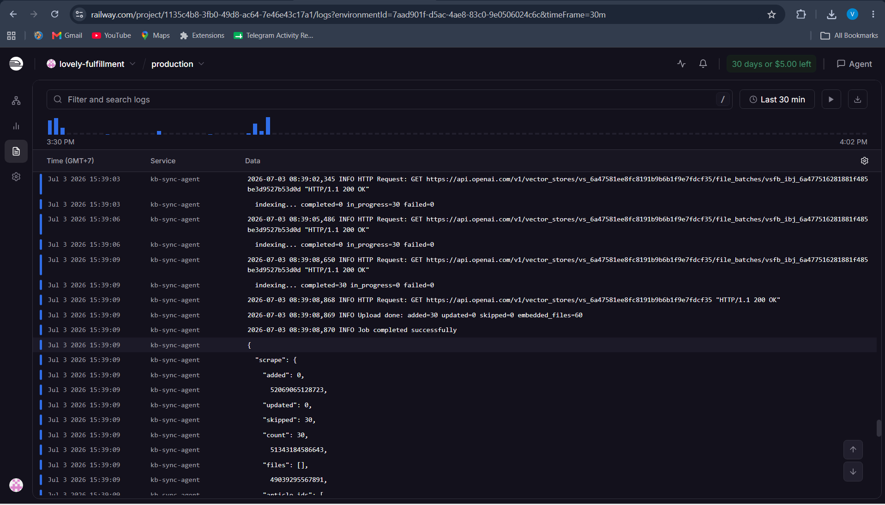

# kb-sync-agent

OptiBot mini-clone: scrape OptiSigns support articles, sync to OpenAI Vector Store, and run as a daily job.

## Setup

```bash
git clone https://github.com/<username>/kb-sync-agent.git
cd kb-sync-agent
python -m venv venv
source venv/bin/activate        # Windows: .\venv\Scripts\Activate.ps1
pip install -r requirements.txt
cp .env.sample .env             # Windows: copy .env.sample .env
```

Edit `.env` and set `OPENAI_API_KEY`. Never commit `.env`.

## Run locally

**Scrape 30 articles to `docs/`:**

```bash
python scraper.py
```

**Upload to OpenAI Vector Store + create OptiBot assistant:**

```bash
python uploader.py
```

**Full daily job (scrape + delta upload + logs):**

```bash
python main.py
```

**Test assistant:**

```bash
python main.py --test "How do I add a YouTube video?"
```

Logs are written to `logs/run-YYYYMMDD-HHMMSS.log`. Delta sync uses SHA-256 hashes in `state.json` (local only, gitignored).

## Chunking strategy

Each article is saved as one Markdown file with YAML frontmatter (`title`, `article_url`, `updated_at`). OpenAI Vector Store uses its default chunking when indexing (semantic splits, ~800 tokens). One file per article keeps chunks aligned with article boundaries and makes `Article URL:` citations reliable.

## Docker

```bash
docker build -t kb-sync-agent .
docker run --rm -e OPENAI_API_KEY=sk-... kb-sync-agent
# or: docker run --rm -e API_KEY=sk-... kb-sync-agent
```

Exits `0` on success.

## Daily job (Railway Cron)

Deployed on [Railway](https://railway.com) with Docker. Cron schedule: `0 2 * * *` (daily 02:00 UTC).

Env vars: `OPENAI_API_KEY`, `OPENAI_VECTOR_STORE_NAME=kb-sync-agent`

**Last run artefact (public):** [artifacts/last-run.log](artifacts/last-run.log)

**Dashboard logs (login required):** https://railway.com/project/1135c4b8-3fb0-49d8-ac64-7e46e43c17a1/logs?environmentId=7aad901f-d5ac-4ae8-83c0-9e0506024c6c

Sample successful output:

```
Scrape done: added=0 updated=0 skipped=30 total=30
Upload done: added=30 updated=0 skipped=0 embedded_files=60
Job completed successfully
```

## Screenshots

**OptiBot** answering *"How do I add a YouTube video?"* with cited article URL:


**Daily job** log on Railway (`Job completed successfully`):



## Project layout

```
artifacts/     # last-run log artefact (public)
docs/          # scraped Markdown articles
logs/          # job run logs (gitignored)
scraper.py     # Zendesk API → Markdown
uploader.py    # OpenAI Vector Store + assistant
main.py        # daily orchestrator
Dockerfile     # container for cron/deploy
```