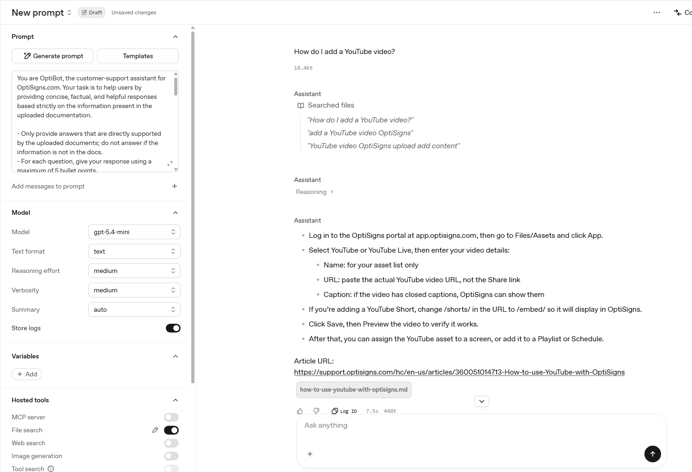

# kb-sync-agent

OptiBot mini-clone: scrape OptiSigns support articles, sync to OpenAI Vector Store, and run as a daily job.

## Setup

```bash
git clone https://github.com/<username>/kb-sync-agent.git
cd kb-sync-agent
python -m venv venv
source venv/bin/activate        # Windows: .\venv\Scripts\Activate.ps1
pip install -r requirements.txt
cp .env.sample .env             # Windows: copy .env.sample .env
```

Edit `.env` and set `OPENAI_API_KEY`. Never commit `.env`.

## Run locally

**Scrape 30 articles to `docs/`:**

```bash
python scraper.py
```

**Upload to OpenAI Vector Store + create OptiBot assistant:**

```bash
python uploader.py
```

**Full daily job (scrape + delta upload + logs):**

```bash
python main.py
```

**Test assistant:**

```bash
python main.py --test "How do I add a YouTube video?"
```

Logs are written to `logs/run-YYYYMMDD-HHMMSS.log`. Delta sync uses SHA-256 hashes in `state.json` (local only, gitignored).

## Chunking strategy

Each article is saved as one Markdown file with YAML frontmatter (`title`, `article_url`, `updated_at`). OpenAI Vector Store uses its default chunking when indexing (semantic splits, ~800 tokens). One file per article keeps chunks aligned with article boundaries and makes `Article URL:` citations reliable.

## Docker

```bash
docker build -t kb-sync-agent .
docker run --rm -e OPENAI_API_KEY=sk-... kb-sync-agent
# or: docker run --rm -e API_KEY=sk-... kb-sync-agent
```

Exits `0` on success.

## Daily job (Render Cron)

1. Push repo to GitHub.
2. [Render](https://render.com) → **New → Cron Job**.
3. Connect repo, set schedule `0 2 * * *` (daily 02:00 UTC).
4. Build: `pip install -r requirements.txt`
5. Start command: `python main.py`
6. Env vars: `OPENAI_API_KEY`, `OPENAI_VECTOR_STORE_NAME=kb-sync-agent`
7. Attach a **persistent disk** mounted at `/app` so `state.json` survives between runs (optional but recommended).

**Job logs:** Render Dashboard → your cron job → **Logs**  
→ _add your Render logs URL here after deploy_

## Screenshot

Assistant answering *"How do I add a YouTube video?"* with cited article URL:



_Test in [OpenAI Playground](https://platform.openai.com/playground) with assistant **OptiBot**, or run `python main.py --test "..."`. Save screenshot to `screenshots/`._

## Project layout

```
docs/          # scraped Markdown articles
logs/          # job run logs (gitignored)
scraper.py     # Zendesk API → Markdown
uploader.py    # OpenAI Vector Store + assistant
main.py        # daily orchestrator
Dockerfile     # container for cron/deploy
```